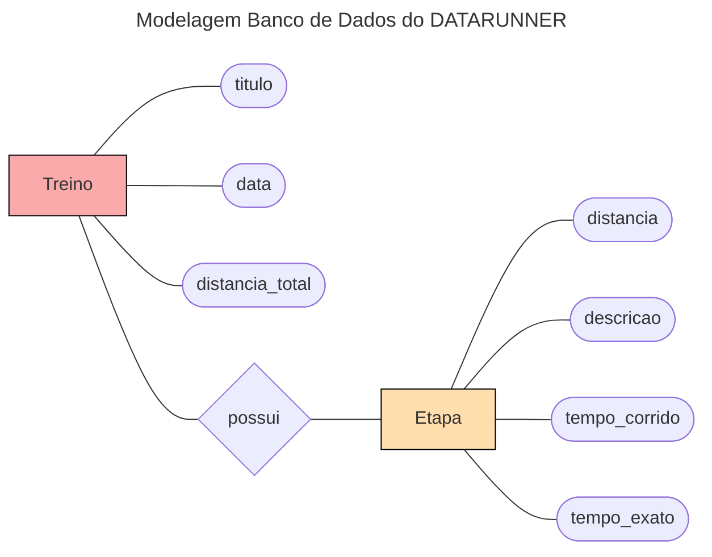

# Backend 

neste readme estará todo o passo a passo de como eu fiz a API usando o djangorestframework

**Sumario de etapas**:
- [1 - inicializando o backend](#1---inicializando-o-backend)
- [2 - Criando os modelos e aplicações do projeto](#2---Criando-os-modelos-e-aplicações-do-projeto)
    - [2.1 - Criando a aplicação](#2.1---Criando-a-aplicação)
    - [2.2 - Criando os modelos](#2.2---Criando-os-modelos)
- [3 - Criando os Serializers](#3---Criando-os-Serializers)
- [4 - Criando nossas Views](#4---Criando-nossas-Views)

## 1 - inicializando o backend

primeiramente precisamos criar um ambiente virtual em python e ativa-ló:

```bash
$ python3 -m venv venv
$ source ./venv/bin/activate
```

agora precisamos instalar o django e o djangorestframewok:

```bash
$ pip install django
$ pip install djangorestframework
```

criaremos um projeto em **django** chamado `backend`:

```bash
$ django-admin startproject backend
```

no arquivo de configurações `settings.py` do diretorio backend coloremos:

```python
    INSTALLED_APPS = [
    ...
    'rest_framework',
    ]
```

## 2 - Criando os modelos e aplicações do projeto

os dados que serão inseridos pela aplicação web serão dados sobre alguns tipos de treinos.

os tipos de treinos terão a seguinte estrutura:



### 2.1 - Criando a aplicação

com isso definido criamos o app `treino`:

```bash
$ python3 manage.py startapp treino
```

colocamos nossa aplicação `treino` no *INSTALLED_APPS* do nosso arquivo de configuração principal `settings.py`:

```python
INSTALLED_APPS = [
    ...
    'treino.apps.TreinoConfig',
    ...
]
```

e para concluir criamos o arquivo `urls.py` em nosso aplicativo `treino` com o urlpatterns vazio por enquanto:

```python
from django.urls import path
from . import views

urlpatterns = [
   
]
```

e adicionamos ele nas configurações gerais das urls do nosso projeto no arquivo `urls.py`:

```python
urlpatterns = [
    path('admin/', admin.site.urls),
    path('treino/', include('treino.urls')),
]
```

### 2.2 - Criando os modelos

de acordo com a modelagem feita, temos que criar 2 modelos para a nossa aplicação. mas antes disso vale a pena mencionar a cardinalidade de cada entidade em seus relacionamentos, ao qual não esta identificado na imagem da modelagem.

- relacionamento de `Treino` --> `Etapa`:

> Treino pode possuir varias etapas e uma etapa pode esta em apenas um Treino. portanto a cardinalidade é de `1:N`

podemos agora partir para a criação defenitiva dos modelos em django. no arquivo `models.py` na aplicação `treino` criaremos os 2 modelos:

**Treino**:
```python
class Treino(models.Model):
    titulo = models.CharField(max_length=200)
    data = models.DateField()
    distancia_total = models.FloatField()

    def __str__(self):
        return f'Treino {self.titulo} com distancia total de {self.distancia_total} realizado na data {self.data}'
```

**Etapa**:
```python
class Etapa(models.Model):
    tipos_etapa = [
        "Corrida",
        "Descanço",
        "Caminhar",
    ]
    treino = models.ForeignKey(Treino, on_delete=models.CASCADE)
    distancia = models.FloatField()
    tempo_corrido = models.TimeField()
    tempo_exato = models.TimeField()
    descricao = models.CharField(max_length=200, choices=[(tipo,tipo) for tipo in tipos_etapa])

    def __str__(self):
        return f'Etapa {self.distancia} km do treino {self.treino.titulo} - tempo exato: {self.tempo_exato} - tipo: {self.descricao}'
```

para criamos de fato nossos modelos devemos rodar os seguintes comandos no terminal:

```bash
$ python3 manage.py makemigrations
$ python3 manage.py migrate
```

## 3 - Criando os Serializers

Durante o desenvolvimento da API com Django Rest Framework, é necessário criar serializers para os modelos criados. Os serializers são classes responsáveis por converter instâncias dos modelos do Python/Django em dados serializados, como JSON, adequados para o tráfego pela internet. Além disso, os serializers também realizam o processo inverso, convertendo os dados serializados de volta em instâncias de modelos do Django. Eles desempenham um papel fundamental na comunicação entre a API e os clientes, garantindo que os dados sejam transmitidos de forma adequada e que sejam válidos, passando por processos de validação antes de serem salvos no banco de dados.

agora devemos criar um novo arquivo chamado `serializers.py` no diretorio da sua aplicação, no nosso caso na aplicação `treino`, e nele criar serializers para os tres modelos usando o `ModelSerializer`:

```python
from rest_framework import serializers
from .models import Treino, Etapa

class TreinoSerializer(serializers.ModelSerializer):
    class Meta:
        model = Treino
        fields = '__all__'

class EtapaSerializer(serializers.ModelSerializer):
    class Meta:
        model = Etapa
        fields = '__all__'
```

usei o **ModelSerializer** por ser mais prático e rápido, mas dependendo do seu sistema você poderá customizar essa classe da forma que o seu sistema precisar.

## 4 - Criando nossas Views

agora vamos criar toda a lógica da nossa API através das nossas views. precisamos definir o que a nossa API deverá realizar.

vamos listar todas as principais funções da nossa API:

**FUNÇÕES PRINCIPAIS**
- listar todos os dados de treinos cadastrados no banco de dados; 
- criar novos treinos apartir dos dados inseridos pelo usuario atraves da interface (frontend);

para criar as views devemos importar todos os modelos do nosso projeto e os seus respectivos serializers. tambem devemos importar um decorator do `rest_framework` chamado `api_view`, que será usado para informar o metodo http função seguinte.

```python
from .models import Treino, Etapa
from .serializers import TipoSerializer, TreinoSerializer, EtapaSerializer
from rest_framework.decorators import api_view
from rest_framework.response import Response
from rest_framework import status
```


