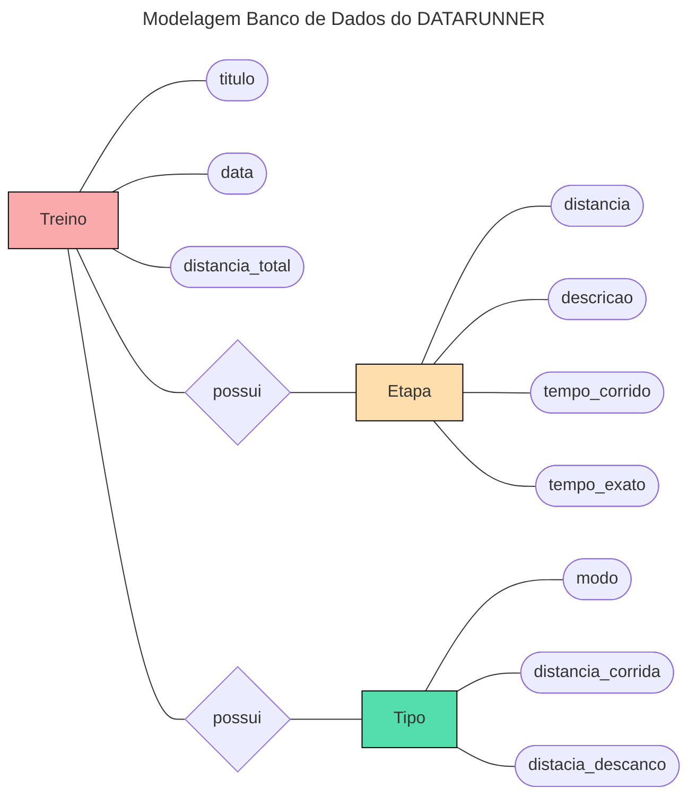

# Backend 

neste readme estará todo o passo a passo de como eu fiz a API usando o **djangorestframework**

**Sumario de etapas**:
- [1 - inicializando o backend](#1---inicializando-o-backend)
- [2 - Criando os modelos e aplicações do projeto️](#2---Criando-os-modelos-e-aplicações-do-projeto)
    - [2.1 - Criando a aplicação](#2-1---Criando-a-aplicação)
    - [2.2 - Criando os modelos](#2-2---Criando-os-modelos)
- [3 - Criando os Serializers](#3---Criando-os-Serializers)
- [4 - Criando nossas Views](#4---Criando-nossas-Views)
    - [4.1 - Analisando a view create_treino](#4-1---Analisando-a-view-create_treino)
- [5 - Realizando o Deploy](#5---Realizando-o-Deploy)

## 1 - inicializando o backend

primeiramente precisamos criar um ambiente virtual em python e ativa-ló:

```bash
$ python3 -m venv venv
$ source ./venv/bin/activate
```

agora precisamos instalar o django e o djangorestframework:

```bash
$ pip install django
$ pip install djangorestframework
```

criaremos um projeto em **django** chamado `backend`:

```bash
$ django-admin startproject backend
```

no arquivo de configurações `settings.py` do diretorio backend colocaremos:

```python
    INSTALLED_APPS = [
    ...
    'rest_framework',
    ]
```

## 2 - Criando os modelos e aplicações do projeto

os dados que serão inseridos pela aplicação web serão dados sobre alguns tipos de treinos.

os tipos de treinos terão a seguinte estrutura:



### 2-1 - Criando a aplicação

com isso definido criamos o app `treino`:

```bash
$ python3 manage.py startapp treino
```

colocamos nossa aplicação `treino` no *INSTALLED_APPS* do nosso arquivo de configuração principal `settings.py`:

```python
INSTALLED_APPS = [
    ...
    'treino.apps.TreinoConfig',
    ...
]
```

e para concluir criamos o arquivo `urls.py` em nosso aplicativo `treino` com o urlpatterns vazio por enquanto:

```python
from django.urls import path
from . import views

urlpatterns = [
   
]
```

e adicionamos ele nas configurações gerais das urls do nosso projeto no arquivo `urls.py`:

```python
urlpatterns = [
    path('admin/', admin.site.urls),
    path('treino/', include('treino.urls')),
]
```

### 2-2 - Criando os modelos

de acordo com a modelagem feita, temos que criar 3 modelos para a nossa aplicação. mas antes disso vale a pena mencionar a cardinalidade de cada entidade em seus relacionamentos, ao qual não esta identificado na imagem da modelagem.

- relacionamento de `Treino` --> `Etapa`:

> Treino pode possuir varias etapas e uma etapa pode esta em apenas um Treino. portanto a cardinalidade é de `1:N`

- relacionamento de `Treino` --> `Tipo`:

> Treino pode possuir apenas um tipo, já tipo pode esta em varios Treinos. portanto a cardinalidade é de `N:1`

podemos agora partir para a criação defenitiva dos modelos em django. no arquivo `models.py` na aplicação `treino` criaremos os 3 modelos:

**Treino**:
```python
class Treino(models.Model):
    titulo = models.CharField(max_length=200)
    data = models.DateField()
    distancia_total = models.FloatField()
    tipo = models.ForeignKey(Tipo, on_delete=models.CASCADE)

    def __str__(self):
        return f'Treino {self.titulo} com distancia total de {self.distancia_total} realizado na data {self.data}'
```

**Tipo**
```python
class Tipo(models.Model):
    modos_tipo = [
        "intervalado",
        "direto",
        "subida",
    ]
    modo = models.CharField(max_length=200, choices=[(tipo,tipo) for tipo in modos_tipo])
    distancia_corrida = models.FloatField()
    distancia_descanco = models.FloatField()

    def __str__(self):
        return f'treino do tipo {self.modo} - {self.distancia_corrida}/{self.distancia_descanco}'
```

**Etapa**:
```python
class Etapa(models.Model):
    tipos_etapa = [
        "Corrida",
        "Descanço",
        "Caminhar",
    ]
    treino = models.ForeignKey(Treino, on_delete=models.CASCADE)
    distancia = models.FloatField()
    tempo_corrido = models.TimeField()
    tempo_exato = models.TimeField()
    descricao = models.CharField(max_length=200, choices=[(tipo,tipo) for tipo in tipos_etapa])

    def __str__(self):
        return f'Etapa {self.distancia} km do treino {self.treino.titulo} - tempo exato: {self.tempo_exato} - tipo: {self.descricao}'
```

para criamos de fato nossos modelos devemos rodar os seguintes comandos no terminal:

```bash
$ python3 manage.py makemigrations
$ python3 manage.py migrate
```

## 3 - Criando os Serializers

Durante o desenvolvimento da API com Django Rest Framework, é necessário criar serializers para os modelos criados. Os serializers são classes responsáveis por converter instâncias dos modelos do Python/Django em dados serializados, como JSON, adequados para o tráfego pela internet. Além disso, os serializers também realizam o processo inverso, convertendo os dados serializados de volta em instâncias de modelos do Django. Eles desempenham um papel fundamental na comunicação entre a API e os clientes, garantindo que os dados sejam transmitidos de forma adequada e que sejam válidos, passando por processos de validação antes de serem salvos no banco de dados.

agora devemos criar um novo arquivo chamado `serializers.py` no diretorio da sua aplicação, no nosso caso na aplicação `treino`, e nele criar serializers para os três modelos usando o `ModelSerializer`:

```python
from rest_framework import serializers
from .models import Treino, Etapa, Tipo

class TipoSerializer(serializers.ModelSerializer):
    class Meta:
        model = Tipo
        fields = '__all__'

class TreinoSerializer(serializers.ModelSerializer):
    class Meta:
        model = Treino
        fields = '__all__'

class EtapaSerializer(serializers.ModelSerializer):
    class Meta:
        model = Etapa
        fields = '__all__'
```

usei o **ModelSerializer** por ser mais prático e rápido, mas dependendo do seu sistema você poderá customizar essa classe da forma que o seu sistema precisar.

## 4 - Criando nossas Views

agora vamos criar toda a lógica da nossa API através das nossas views. precisamos definir o que a nossa API deverá realizar.

vamos listar todas as principais funções da nossa API:

**FUNÇÕES PRINCIPAIS**
- listar todos os dados de treinos cadastrados no banco de dados; 
- criar novos treinos apartir dos dados inseridos pelo usuario atraves da interface (frontend);
- criar novos tipos de treinos apartir dos dados inseridos pelo usuario atraves da interface (frontend);

para criar as views devemos importar todos os modelos do nosso projeto e os seus respectivos serializers. tambem devemos importar um decorator do `rest_framework` chamado `api_view`, que será usado para informar o metodo http função seguinte.

```python
from .models import Treino, Etapa
from .serializers import TipoSerializer, TreinoSerializer, EtapaSerializer
from rest_framework.decorators import api_view
from rest_framework.response import Response
from rest_framework import status
```
teremos varias views para realizar coisas simples como listar todos os Tipos, Treinos e Etapas. então mostrarei views mais interresantes do ponto de vista da nossa aplicação.

```python
@api_view(['POST'])
def create_treino(request):
    pass
```

lembrando que precisamos definir as urls para cada uma função. para isso basta colcoar no arquivo `urls.py` da nossa aplicação `treino`:

```python
urlpatterns = [
   path('create_treino/', views.create_treino),
]
```
neste momento já consiguimos acessar cada função atraves das urls definidas. 

### 4-1 - Analisando a view create_treino:

vamos analisar a implementação da função `create_treino`:

```python
@api_view(['POST'])
def create_treino(request):
    data = request.data
    data_serial = TreinoSerializer(data=data)
    if data_serial.is_valid():
        response = {
            "status": "sucess",
            "messagem": "treino criado com sucesso!",
            "code": status.HTTP_201_CREATED,
            "dados": data
        }
        data_serial.save()
        dados_tempo = {
            "tempos": data["dados_tempo"],
            "tipo": data["tipo"],
            "treino": Treino.objects.latest('id'),
        }
        data_etapa = get_tempos(dados_tempo)
        for dado in data_etapa:
            etapa = Etapa(treino=dado["treino"], distancia=dado["distancia"], tempo_corrido=dado["tempo_corrido"], tempo_exato=dado["tempo_exato"],descricao=dado["descricao"])
            etapa.save()        
    else:
        return Response(data_serial.errors, status=status.HTTP_400_BAD_REQUEST)
```

primeiro precisamos entender que os dados que o usuario irá mandar possui esse formato:

```JSON
{
    "titulo":"teste"
    "data":"2024-3-15"
    "distancia_total":2000
    "tipo":4
    "dados_tempo":"01      00:05.01      00:53.01   02      00:05.65      00:02.64   03      00:07.83      00:02.18   04      00:09.95      00:02.12   05      00:10.49      00:00.54"
}
```

nos serializamos esse dado recebido pela requisição atraves do serializador do modelo `Treino` e verificamos se os dados estão consistentes aplicando o metodo `is_valid()`. salvamos a instancia do treino com o `save()`.

precisamos agora associar os tempos informados pelo usuario a cada etapa do treino. para isso usamos uma função chamada `get_tempos()` que recebe um dicionario com dados dos tempos fornecidos, além do seu tipo e treino associados.

a função `get_tempos` possui este formato:

```python
def get_tempos(dados):
    dados_tempos = []
    tipo_treino = Tipo.objects.get(id=dados["tipo"])
    data = re.findall(r'\d{2}:\d{2}\.\d{2}', dados["tempos"])
    data_tempo = []
    for i in range(0,len(data)-1,2):
        data_tempo.append([
            data[i], data[i+1]
        ])
    
    if tipo_treino.modo == "intervalado" or tipo_treino.modo == "subida":
        for index, tempos in enumerate(data_tempo):
            if index % 2 == 0:
                descricao = "corrida"
            else:
                descricao = "descanco"
            dict_etapa = {
                "distancia": tipo_treino.distancia_corrida,
                "tempo_corrido": tempos[0],
                "tempo_exato": tempos[1],
                "descricao": descricao,
                "treino": dados["treino"],
            }
            dados_tempos.append(dict_etapa)

    elif tipo_treino.modo == "direto":
        for tempos in data_tempo:
            dict_etapa = {
                "distancia": tipo_treino.distancia_corrida,
                "tempo_corrido": tempos[0],
                "tempo_exato": tempos[1],
                "descricao": "corrida",
                "treino": dados["treino"],
            }
            dados_tempos.append(dict_etapa)

    return dados_tempos
```

o que a função `get_tempos()` faz em resumo, é preparar um dicionario com os dados "formatados" para que ao voltar a view `create_treino()` fique mais simples criar as etapas do treino, que neste caso é criado "manualmente". com isso nos conseguimos salvar os treinos e suas etapas associadas.

algumas outras views foram criadas. e o arquivo `urls.py` da nossa aplicação `treino` que antes estava vazio agora possui essa cara:

```python
from django.urls import path
from . import views

urlpatterns = [
   path('list_treinos/', views.list_treinos),
   path('create_treino/', views.create_treino),
   path('create_tipo/', views.create_tipo),
   path('get_tipos/', views.get_tipos),
   path('get_etapas/', views.get_etapas),
   path('get_treino/<int:id>/', views.get_treino),
   path('get_treino_tipo/<int:id_tipo>/', views.get_treino_tipo),
]
```

## 5 - Realizando o Deploy

Antes de seguirmos para as configurações no **pythonanywhere.com**, precisamos realizar algumas alterações no arquivo `settings.py` do nosso projeto:

```python
DEBUG = False

ALLOWED_HOSTS = ['<nome_do_seu_user>.pythonanywhere.com']
...
STATIC_ROOT = os.path.join(BASE_DIR, 'static')
```

e rodamos os seguintes comandos:

```bash
$ python3 manage.py collectstatic
$ pip freeze > requirements.txt
```

O deploy da API foi feito no **pythonanywhere.com** e foram seguidos os seguintes passos:

1. No dashboard do pythonanywhere.com criamos um novo console bash;
2. No console clonamos o repositorio:

```bash
$ git clone <url_repo>
```

3. criamos um ambiente virtual e ativamos:

```bash
$ python -m venv venv
$ source ./venv/bin/activate
```

4. instalamos o django e as dependências:

```bash
$ pip install django
```

vá até o diretório onde esta o arquivo `requirements.txt` e execute esse código:

```bash
$ pip install -r requirements.txt
```

5. agora vá até a aba **web** do pythonanywhere.com e crie um novo app, no momento em que você for criar um novo app, escolha a opção **manual configuration** e escolha a versão do python compativel com a que você usou no seu projeto.

6. ainda na aba **web**, vá até a seção **code** e adicione o diretorio onde esta o seu projeto django. se estiver com duvidas onde está o seu projeto, basta ir para a aba **files** e navegar entre os diretorios até encontrar o seu projeto.

**obs**: lembre-se que você deve colocar o diretório em que contém o arquivo `manage.py`

7. ainda na aba **web**, na seção **Virtualenv** você deverá colocar o diretorio `env` que você criou no tópico 3.

8. Continuando na aba **web**, vá até a seção **Static files** e adicione `/static/` na **URL** e na parte do **DIRECTORY** informe a pasta chamada `static` que foi gerada ao rodar o comando `collectstatic`.

9. Após todas essas configurações, retorne ao topo da aba **web** e faça um **reload**.

Após essas etapas, acredito que sua API deverá esta rodando na url **nome_user.pythonanywhere.com**.
