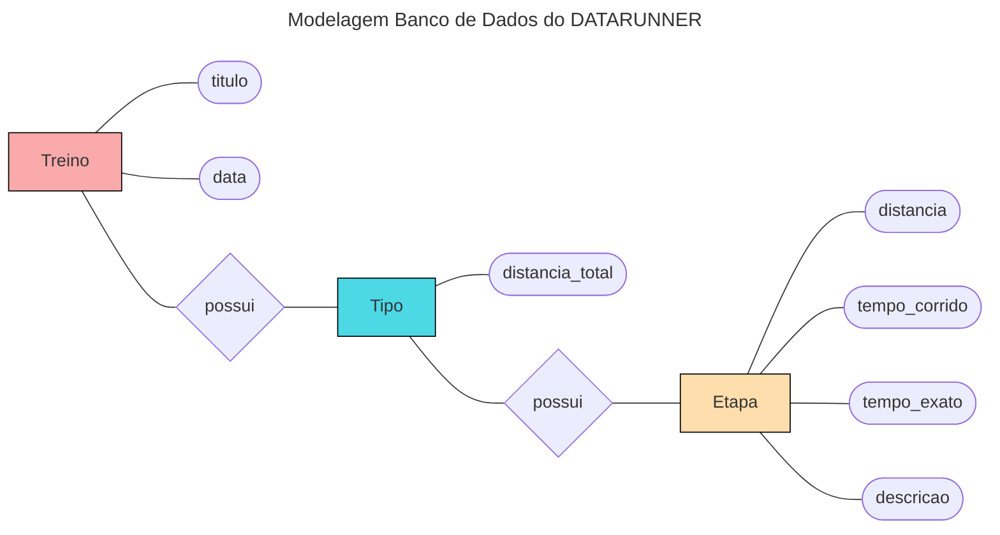

# Backend 

neste readme estará todo o passo a passo de como eu fiz a API usando o djangorestframework

**Sumario de etapas**:
- [1 - inicializando o backend](#1---inicializando-o-backend)
- [2 - Criando os modelos e aplicações do projeto](#2---Criando-os-modelos-e-aplicações-do-projeto)
    - [2.1 - Criando a aplicação](#2.1---Criando-a-aplicação)
    - [2.2 - Criando os modelos](#2.2---Criando-os-modelos)
- [3 - Criando os Serializers](#3---Criando-os-Serializers)

## 1 - inicializando o backend

primeiramente precisamos criar um ambiente virtual em python e ativa-ló:

```bash
$ python3 -m venv venv
$ source ./venv/bin/activate
```

agora precisamos instalar o django e o djangorestframewok:

```bash
$ pip install django
$ pip install djangorestframework
```

criaremos um projeto em **django** chamado `backend`:

```bash
$ django-admin startproject backend
```

no arquivo de configurações `settings.py` do diretorio backend coloremos:

```python
    INSTALLED_APPS = [
    ...
    'rest_framework',
    ]
```

## 2 - Criando os modelos e aplicações do projeto

os dados que serão inseridos pela aplicação web serão dados sobre alguns tipos de treinos.

os tipos de treinos terão a seguinte estrutura:



### 2.1 - Criando a aplicação

com isso definido criamos o app `treino`:

```bash
$ python3 manage.py startapp treino
```

colocamos nossa aplicação `treino` no *INSTALLED_APPS* do nosso arquivo de configuração principal `settings.py`:

```python
INSTALLED_APPS = [
    ...
    'treino.apps.TreinoConfig',
    ...
]
```

e para concluir criamos o arquivo `urls.py` em nosso aplicativo `treino` com o urlpatterns vazio por enquanto:

```python
from django.urls import path
from . import views

urlpatterns = [
   
]
```

e adicionamos ele nas configurações gerais das urls do nosso projeto no arquivo `urls.py`:

```python
urlpatterns = [
    path('admin/', admin.site.urls),
    path('treino/', include('treino.urls')),
]
```

### 2.2 - Criando os modelos

de acordo com a modelagem feita, temos que criar 3 modelos para a nossa aplicação. mas antes disso vale a pena mencionar a cardinalidade de cada entidade em seus relacionamentos, ao qual não esta identificado na imagem da modelagem.

- relacionamento de `Treino` --> `Tipo`:

> Treino pode possuir apenas um tipo e um tipo pode esta em apenas um Treino. portanto a cardinalidade é de `1:1`

- relacionamento de `Tipo` --> `Etapa`:

>  Tipo pode possuir várias etapas mas etapas só pode ter um tipo associado. portanto a cardinalidade é de `1:N`

podemos agora partir para a criação defenitiva dos modelos em django. no arquivo `models.py` na aplicação `treino` criaremos os 3 modelos:

**TIPO**:
```python
class Tipo(models.Model):
    distancia_total = models.FloatField()
    
    def __str__(self):
        return f'Tipo de treino {self.distancia_total}'
```

**Treino**:
```python
class Treino(models.Model):
    titulo = models.CharField(max_length=200)
    data = models.DateField()
    tipo = models.ForeignKey(Tipo, on_delete=models.CASCADE)

    def __str__(self):
        return f'Treino {self.titulo} realizado na data {self.data}'
```

**Etapa**:
```python
class Etapa(models.Model):
    tipos_etapa = [
        "Corrida",
        "Descanço",
        "Caminhar",
    ]

    tipo = models.ForeignKey(Tipo, on_delete=models.CASCADE)
    distancia = models.FloatField()
    tempo_corrido = models.TimeField()
    tempo_exato = models.TimeField()
    descricao = models.CharField(max_length=200, choices=[(tipo,tipo) for tipo in tipos_etapa])

    def __str__(self):
        return f'Etapa {self.distancia} - tempo exato: {self.tempo_exato} - tipo: {self.descricao}'
```

para criamos de fato nossos modelos devemos rodar os seguintes comandos no terminal:

```bash
$ python3 manage.py makemigrations
$ python3 manage.py migrate
```

## 3 - Criando os Serializers